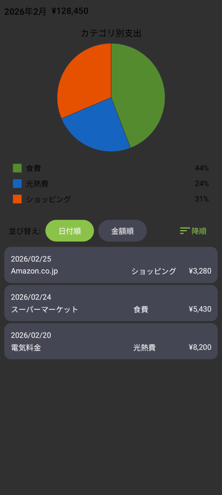
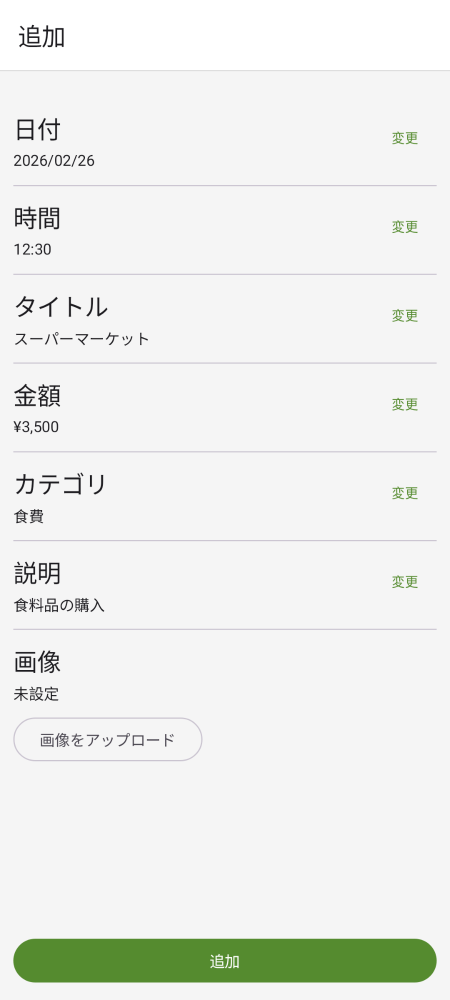
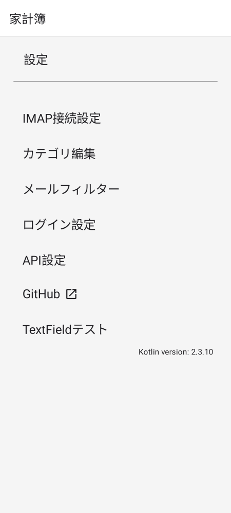
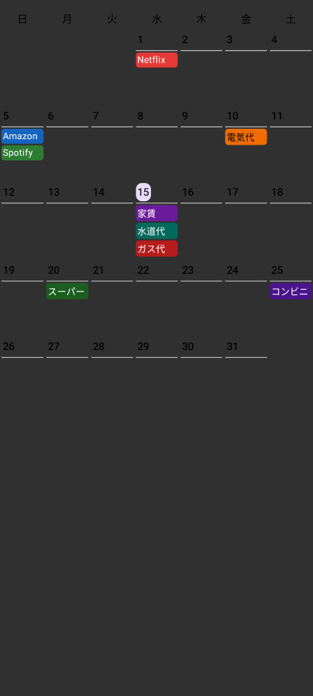

# 家計簿
決済メールを中心とした家計簿ソフト。

## スクリーンショット

スクリーンショットは[Paparazzi](https://github.com/cashapp/paparazzi)で生成されます。
各画面に定義された`@Preview` composableが自動的にスクリーンショットテストの対象になります。

以下のコマンドで参照画像を生成・更新できます:
```shell
./gradlew :frontend:common:ui:recordPaparazziDebug
```

生成された画像は `frontend/common/ui/src/test/snapshots/` に出力されます。
`README/` フォルダの画像は最新の参照画像をコピーして更新してください。

<table>
<tr>
<td></td>
<td></td>
<td></td>
<td></td>
<td></td>
</tr>
</table>

# 機能
- メールサーバーからメールを取得し、パースして決済情報を登録する
  - 家計簿サービスは、API連携に対応していないものはパスワードを渡さないと詳細な情報が得られない。パスワードを他人に渡したく無いため、開発された。
- 資産管理機能は無い
  - 使用用途の管理だけを行い、財産の管理は行わない

# 使用技術
- フロント
  - [Kotlin/JS](https://kotlinlang.org/docs/js-overview.html)
  - [Jetbrains Compose Multiplatform Web](https://www.jetbrains.com/lp/compose-multiplatform/)
  - [Jetbrains Compose HTML](https://github.com/JetBrains/compose-multiplatform#compose-html)
  - [Apollo](https://www.apollographql.com/)
- バックエンド
  - [Ktor](https://ktor.io/)
  - [GraqhQL Java](https://www.graphql-java.com/)
  - [GraphQL Java Kickstart](https://www.graphql-java-kickstart.com/)
  - [graphql-java-codegen](https://github.com/kobylynskyi/graphql-java-codegen)
- API
  - [GraphQL](https://graphql.org/)
 
# 準備するもの
- メールサーバー
  - ここに購入メールを転送する
- MariaDB
  - [テーブルを作成する](https://github.com/matsudamper/kake-bo/tree/70e838f4d1c31460ccb110290cb0a3343b124858/backend/db/src/jvmMain/resources/sql)

# 動作手順
まずはフロントをビルドする。その後にバックエンドを起動する。
```shell
./gradlew :frontend:app:jsBrowserProductionWebpack
```
必要な環境変数は[ServerEnv.kt](https://github.com/matsudamper/kake-bo/blob/563272f802d15d6620432a53ada88fbdd5cf9561/backend/base/src/jvmMain/java/net/matsudamper/money/backend/base/ServerEnv.kt)を参照

# Download Schema
サーバー側の環境変数は`IS_DEBUG=true`は必須。
`schema_update_local.env`を使用してbackendを立ち上げれば良い。
```shell
./gradlew :frontend:common:graphql:schema:downloadSchema
```

# Update Code
DB
```shell
./gradlew generateDbCode
```

GraphQl(Front)
```shell
./gradlew generateApolloSources
```
